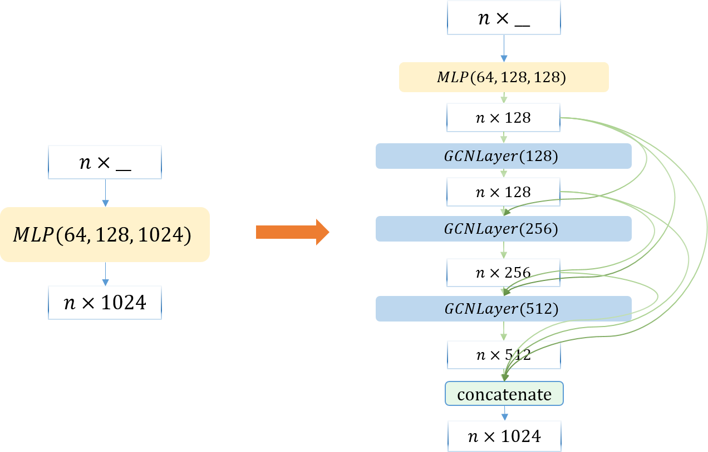

# Pointcloud Classification with PointNet and GCNs

This is a project using PointNet and GCNs for pointcloud classification. We implement the original PointNet<sup>[1]</sup> and make some attempts on incorporating graph convolutional networks<sup>[2]</sup> into PointNet. Both models are trained and tested on the ModelNet40<sup>[3]</sup> Dataset.

## Model Description

This is an illustration of PointNet, taken from Figure 2 in [1]. The max-pooling operation aggregates the local feature from each point and ensures permutation invariance. The T-Nets are mini version of PointNet, consisting of a shared *MLP(64, 128, 1024)*, a max-pooling operator and a *MLP(512, 256, k×k)*, which regress the *n×k* input to a *k×k* transform. 


To incorporate graph convolutional  networks, I add GCN layers right behind the three *MLP(64, 128, 1024)* s (one in the main PointNet, two in TNets), illustrated as follows. GCNs require graphs as input, which are constructed by a thresholded Gaussian kernel weighting function. Hopefully the modification will endow the network with more capacity to capture structural information, and thus result in better performances.



## Implementation

We implement both models in *pytorch*. Codes are stored in `Models/PointNet/` and `Models/PointNet+GCN`, respectively. The dataset classes in `Models/*/data.py` are modified from https://github.com/WangYueFt/dgcnn/blob/master/pytorch/data.py. The pytorch implementation for GCN ( `Models/PointNet+GCN/layers.py` and the class `GCN` in`Models/PointNet+GCN/models.py`) are borrowed from https://github.com/tkipf/pygcn/blob/master/pygcn/layer.py. 

Similar to [1], an regularization loss term (with weight 0.001) encouraging the 64-by-64 feature transform matrix to be close to an orthonormal matrix is added to the total loss. We use Adam optimizer, with learning rate initially set as 0.001 and decayed by 0.95 every epoch. The number of points sampled from the pointcloud is chosen to be 2048 for PointNet and 512 for the GCN version (since constructing the graph is really inefficient when *#points* is large). 

**Results.** The overall accuracy over 40 classes of PointNet is 89.14100%, comparable to the results given by [1] (89.2%). Unfortunately, the accuracy of our GCN version is 87.7229%, acceptable but slightly worser than the former one. We think the reasons may be twofold. First, the GCN version of PointNet uses only 512 points. Second, the graph structure along with the edge weights processed by a graph convolutional network is fixed, which may limit the model's representation power for complex features.

## How to Use

First switch the working directory, by

```shell
cd Models/"PointNet" 
```

```shell
cd Models/"PointNet+GCN" 
```

### Training

Run

```shell
python train.py -lr=1e-3 --num_points=2048 --model="PointNet.pt"
```

```shell
python train.py -lr=1e-3 --num_points=512 --model="PointNetGCN.pt"
```

for training. The ModelNet40 dataset will be automatically downloaded (you can also download it manually from https://shapenet.cs.stanford.edu/media/modelnet40_ply_hdf5_2048.zip , and unzip the file to `./Datasets/` directory). 

The trained model will be stored in `PointNet.pt` or `PointNetGCN.pt`. 

### Testing

Run

```shell
python test.py --num_points=2048 --model="PointNet.pt"
```

```shell
python test.py --num_points=512 --model="PointNetGCN.pt"
```

for testing the trained model (loaded from `PointNet.pt` or `PointNetGCN.pt`).

### Using pretrained models

If you want to use our pretrained models, please download them from the following links:

- PointNet: https://drive.google.com/file/d/1VXUIBIGwcfarbz0w9lhJfOP7uXr9eNYk/view?usp=sharing
- PointNet with GCNs: https://drive.google.com/file/d/1yP0yx7cr2CuHaLQK7e7ozodqGL6V1q-X/view?usp=sharing

Please save the `*.pt`  files in `Models/"PointNet"` and `Models/"PointNet+GCN"`, rename them as `PointNet.pt` and `PointNetGCN.pt`, respectively, and run the previous testing command.

## References

[1] Charles, R. Q., Su, H., Kaichun, M., & Guibas, L. J. (2017). PointNet: Deep Learning on Point Sets for 3D Classification and Segmentation. *computer vision and pattern recognition*.

[2] Kipf, T., & Welling, M. (2017). Semi-Supervised Classification with Graph Convolutional Networks. *international conference on learning representations*.

[3] Wu, Z., Song, S., Khosla, A., Yu, F., Zhang, L., Tang, X., & Xiao, J. (2015). 3D ShapeNets: A deep representation for volumetric shapes. *computer vision and pattern recognition*.
